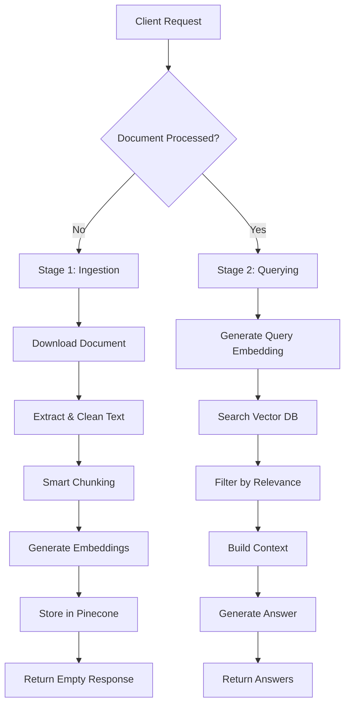

# 🚀 Advanced RAG Pipeline with FastAPI

A production-ready **Retrieval-Augmented Generation (RAG)** system that intelligently processes documents and answers questions with enterprise-grade reliability and performance.

## 🌟 What Makes Our RAG Pipeline Stand Out yes

### 🧠 **Intelligent Document Processing**
- **Multi-format Support**: Seamlessly handles PDFs and DOCX files with automatic format detection
- **Smart Text Chunking**: Sentence-aware chunking with configurable overlap preserves semantic context
- **Content Validation**: Comprehensive input validation and empty content handling

### 🎯 **Advanced Retrieval System**
- **Hybrid Retrieval**: Combines similarity scores with configurable thresholds for precision
- **Relevance Filtering**: Only passes high-quality, relevant chunks to the LLM
- **Context Optimization**: Dynamic context length management prevents token overflow
- **Batch Processing**: Efficient vector upserts with error recovery mechanisms

### 🛡️ **Production-Grade Architecture**
- **Robust Error Handling**: Comprehensive exception handling for all API calls
- **Security First**: API key authentication with proper authorization headers
- **Observability**: Detailed logging throughout the pipeline for debugging
- **Scalable Design**: Clean separation of concerns between API and business logic

### ⚡ **Performance Optimizations**
- **Namespace-based Caching**: Document processing happens only once per unique document
- **Efficient Embeddings**: Batch embedding generation reduces API calls
- **Smart Context Building**: Relevance-based ranking and length optimization
- **Connection Pooling**: Optimized Pinecone and Google AI API usage

## 🏗️ System Architecture

### **Two-Stage Processing Model**



### **Namespace-Based Document Management**
- Each document URL generates a unique SHA-256 hash as namespace
- Prevents duplicate processing and enables efficient caching
- Supports multi-tenant document isolation

### **Layered Architecture**

```
┌─────────────────────────────────────┐
│           API Layer (main.py)       │
│  • Authentication & Authorization   │
│  • Request/Response Handling        │
│  • HTTP Error Management           │
└─────────────────────────────────────┘
                    │
┌─────────────────────────────────────┐
│       Business Logic (brainRag.py)  │
│  • Document Processing              │
│  • Embedding Generation             │
│  • Vector Operations                │
│  • Answer Generation                │
└─────────────────────────────────────┘
                    │
┌─────────────────────────────────────┐
│         External Services           │
│  • Google AI (Gemini + Embeddings) │
│  • Pinecone Vector Database         │
│  • Document Download Services       │
└─────────────────────────────────────┘
```

## 🔧 Technical Stack

| Component | Technology | Purpose |
|-----------|------------|---------|
| **API Framework** | FastAPI | High-performance async web framework |
| **LLM** | Google Gemini 1.5 Flash | Answer generation with optimized parameters |
| **Embeddings** | Google text-embedding-004 | Semantic text representation |
| **Vector DB** | Pinecone v7.3.0 | Scalable similarity search |
| **Document Processing** | PyPDF + python-docx | Multi-format text extraction |
| **Authentication** | Bearer Token | Secure API access control |

## 🚀 Quick Start

### Prerequisites
- Python 3.10+
- Google AI API Key
- Pinecone Account
- Docker (optional)

### 1. Environment Setup

```bash
# Clone repository
git clone <your-repo-url>
cd rag-pipeline

# Create virtual environment
python -m venv venv
source venv/bin/activate  # Linux/Mac
# .\venv\Scripts\activate  # Windows

# Install dependencies
pip install -r requirements.txt
```

### 2. Configuration

Create `.env` file:

```env
# API Keys
GOOGLE_API_KEY=your_google_ai_api_key
PINECONE_API_KEY=your_pinecone_api_key
MY_API_KEY=your_secure_api_key

# Pinecone Configuration
PINECONE_HOST=your-index-host.pinecone.io
PINECONE_INDEX_NAME=your-index-name
```

### 3. Pinecone Index Setup

Create a Pinecone index with:
- **Dimensions**: 768 (for text-embedding-004)
- **Metric**: Cosine
- **Cloud**: Any (recommend serverless)

### 4. Run the Application

```bash
# Development server
uvicorn main:app --reload

# Production server
uvicorn main:app --host 0.0.0.0 --port 8000
```

## 📋 API Usage

### Endpoint: `POST /hackrx/run`

**Headers:**
```
Content-Type: application/json
Authorization: Bearer <your_api_key>
```

**Request Body:**
```json
{
    "documents": "https://example.com/document.pdf",
    "questions": [
        "What is the main topic of this document?",
        "Who are the key stakeholders mentioned?"
    ]
}
```

**Response (First Call - Ingestion):**
```json
{
    "answers": []
}
```

**Response (Subsequent Calls - Querying):**
```json
{
    "answers": [
        {
            "question": "What is the main topic of this document?",
            "answer": "The document discusses advanced RAG implementation strategies..."
        },
        {
            "question": "Who are the key stakeholders mentioned?",
            "answer": "The key stakeholders include developers, data scientists, and..."
        }
    ]
}
```

### Example cURL Request

```bash
curl -X POST 'http://localhost:8000/hackrx/run' \
  -H 'Content-Type: application/json' \
  -H 'Authorization: Bearer your_api_key' \
  -d '{
    "documents": "https://arxiv.org/pdf/2005.11401.pdf",
    "questions": [
      "What is retrieval-augmented generation?",
      "What are the main benefits of RAG?"
    ]
  }'
```

## 🏭 Production Deployment

### Docker Deployment

```dockerfile
FROM python:3.10-slim

WORKDIR /app

# Install system dependencies
RUN apt-get update && apt-get install -y \
    build-essential \
    && rm -rf /var/lib/apt/lists/*

# Install Python dependencies
COPY requirements.txt .
RUN pip install --no-cache-dir -r requirements.txt

# Copy application code
COPY . .

# Expose port
EXPOSE 8000

# Run application
CMD ["uvicorn", "main:app", "--host", "0.0.0.0", "--port", "8000"]
```

### Build and Run

```bash
# Build image
docker build -t rag-pipeline .

# Run container
docker run -p 8000:8000 --env-file .env rag-pipeline
```

### Cloud Deployment

**Google Cloud Run:**
```bash
# Build and deploy
gcloud run deploy rag-pipeline \
  --source . \
  --platform managed \
  --region us-central1 \
  --allow-unauthenticated
```

## 🔒 Key Design Decisions

### **1. Security Architecture**
- **Bearer Token Authentication**: Protects against unauthorized access
- **Environment-based Configuration**: Keeps sensitive data secure
- **Input Validation**: Prevents injection attacks and malformed requests

### **2. Error Handling Strategy**
- **Layered Exception Handling**: Different error types handled appropriately
- **Graceful Degradation**: System continues operation despite partial failures
- **Informative Error Messages**: Clear feedback without exposing internals

### **3. Performance Optimizations**
- **Document Deduplication**: SHA-256 hashing prevents reprocessing
- **Batch Operations**: Reduces API calls and improves throughput
- **Context Length Management**: Prevents token overflow while maximizing relevance

### **4. Scalability Considerations**
- **Stateless Design**: Easy horizontal scaling
- **External State Management**: All state in Pinecone, not in-memory
- **Async Operations**: Non-blocking I/O for better concurrency

## 📊 Monitoring and Observability

### Logging Levels
- **INFO**: Request processing, successful operations
- **WARNING**: Non-critical issues, fallback scenarios  
- **ERROR**: API failures, processing errors
- **DEBUG**: Detailed execution flow (development only)

### Key Metrics to Monitor
- Document processing time
- Query response time
- Embedding generation latency
- Pinecone operation success rate
- API authentication failures

## 🔄 System Flow

### **Ingestion Pipeline**
1. **URL Validation** → Document download with timeout
2. **Format Detection** → Auto-detect PDF/DOCX from headers
3. **Text Extraction** → Format-specific parsing with error handling
4. **Smart Chunking** → Sentence-aware splitting with overlap
5. **Batch Embedding** → Efficient API usage with retry logic
6. **Vector Storage** → Batch upsert to Pinecone with unique IDs

### **Query Pipeline**
1. **Query Embedding** → Convert question to vector representation
2. **Similarity Search** → Retrieve relevant chunks from Pinecone
3. **Relevance Filtering** → Apply score thresholds for quality
4. **Context Building** → Rank and concatenate relevant content
5. **Answer Generation** → LLM inference with optimized parameters
6. **Response Formatting** → Structure output for client consumption

## 🎯 Future Enhancements

- **Reranking Models**: Cross-encoder reranking for improved relevance
- **Multi-modal Support**: Image and table processing capabilities  
- **Streaming Responses**: Real-time answer generation
- **Caching Layer**: Redis integration for faster repeated queries
- **Analytics Dashboard**: Usage metrics and performance monitoring
- **Batch Processing**: Multi-document ingestion endpoints

## 🤝 Contributing

1. Fork the repository
2. Create a feature branch
3. Implement changes with tests
4. Submit a pull request

## 📄 License

This project is licensed under the MIT License - see the LICENSE file for details.

**Built with ❤️ for production-grade RAG applications**
